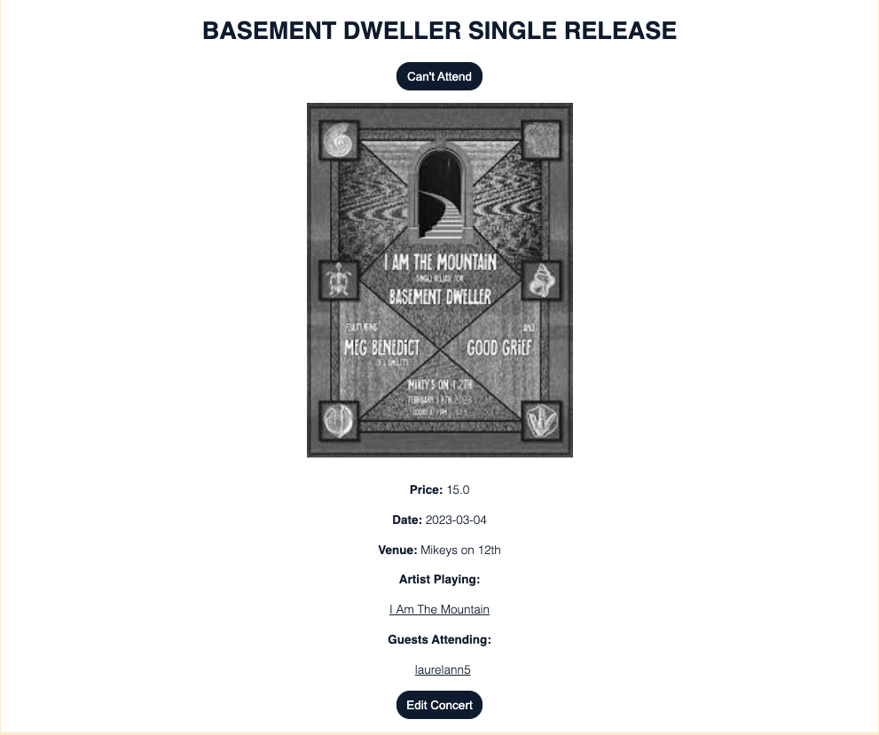
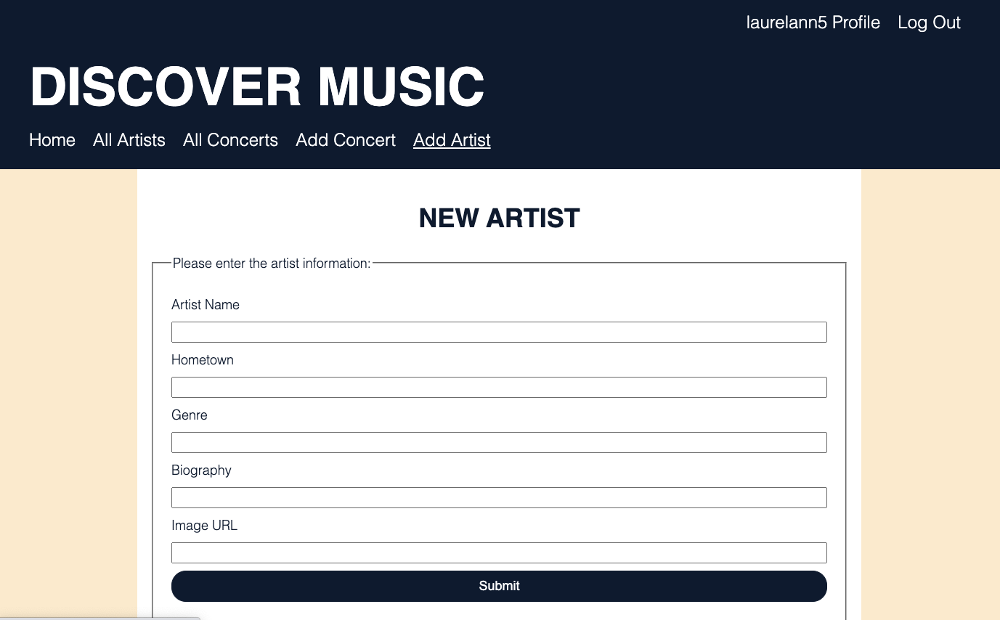
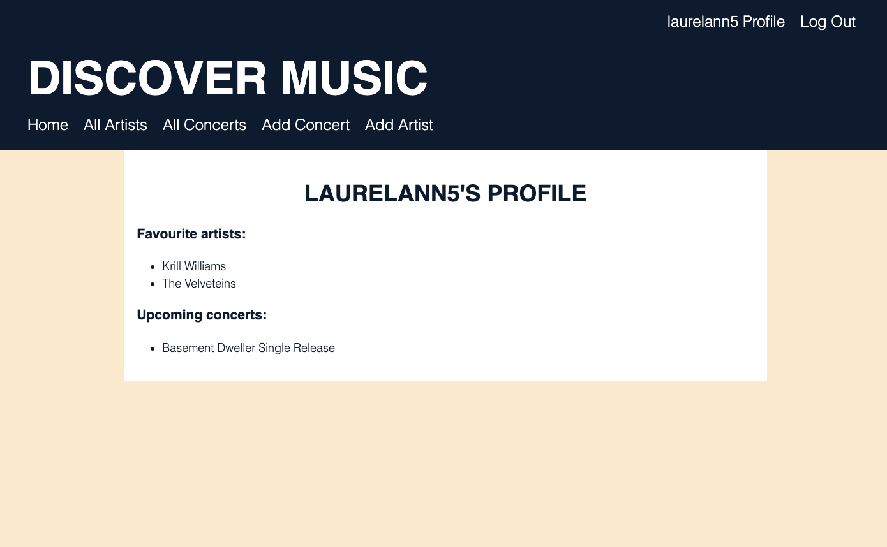

# Discover Music Database

A concert app that allows users to create an account and login to follow their favourite artists, see any upcoming concerts that artists are playing, and add the event to their list of "attending"/upcoming events. Built with a framework of Flask, SQLAlchemy, and WTForms

## Features:

- User profiles with login authentication
- Create and edit concerts
- Create and edit artist profiles
- Follow favourite artists
- Attend upcoming concerts

## Run Locally:

in your terminal, run:

```
python3 app.py
```

## View on Render:

https://discovermusic.onrender.com/

## Screenshots:






